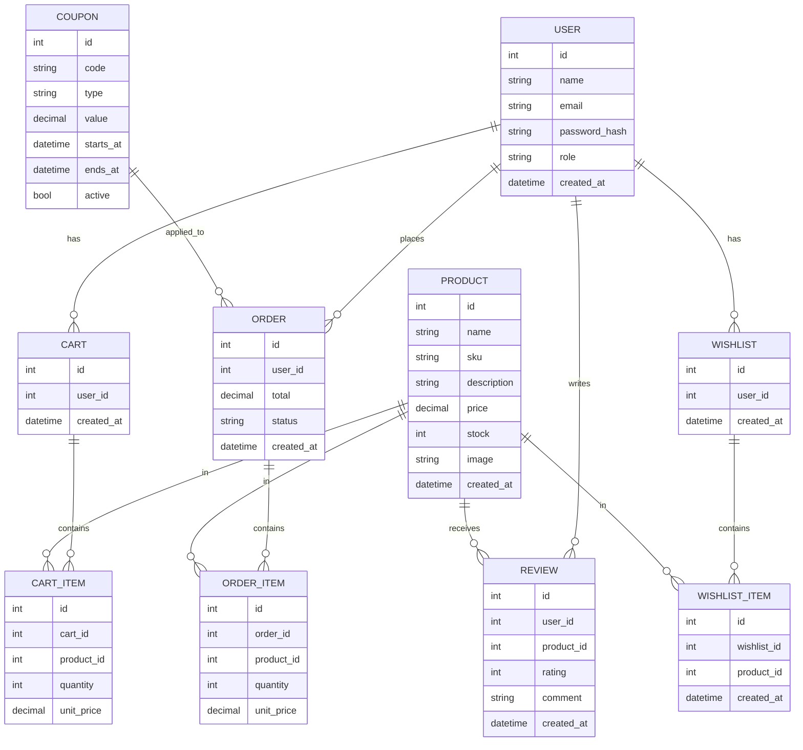
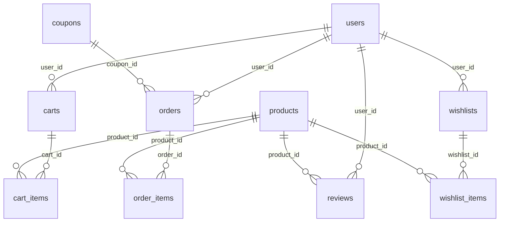

# Vinshop

Boutique e-commerce PHP (MVC).

## Fonctionnalites

- Authentification, profil utilisateur
- Catalogue produits, recherche, filtres
- Panier, commande, historique
- Coupons, wishlist
- Reviews produits
- Back-office admin

## Prerequis

- PHP 8.x
- MariaDB
- Nginx/Apache
- Docker Compose

## Installation (locale)

1. Cloner le projet.
2. Creer une base de donnees et importer `vinshop.sql`.
3. Configurer `config/Database.php`.
4. Configurer le vhost web vers `public/`.
5. Lancer le serveur web et MySQL.

## Installation (Docker)

1. `docker compose up -d --build`
2. Importer `vinshop.sql` dans la base.
3. Ouvrir le site via le port expose par nginx.

## Arborescence

- `controllers/` logique applicative
- `models/` acces donnees
- `views/` vues PHP
- `routes/` definitions des routes
- `public/` assets web

## MCD (Mermaid ER)

## MLD (Mermaid ER)

## Flux commande (Mermaid)

